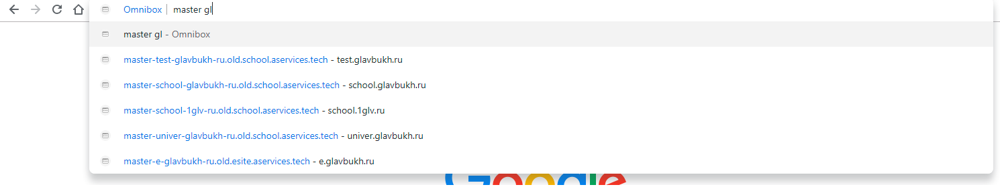

# Аддон для получение урлов стэндов.

В файле `data/stands.json` описаны связки проектов и доменов.

Для получение саджестов надо в адресной строке браузера ввести `stand {имя бранча} {базовый домен проекта}`.

